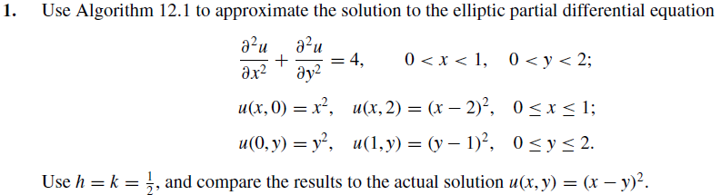
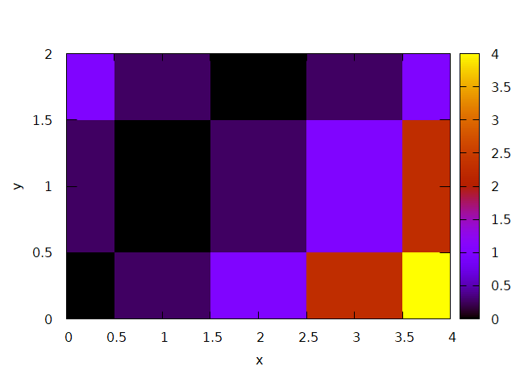
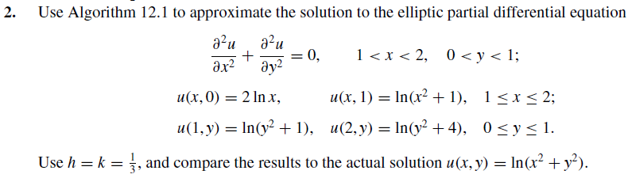

# EDP

Equações diferenciais parciais numericas é o ramo da analise numerica que estuda a solução numerica de equações diferenciais parciais (EPDs)

## Metodo das diferenças finitas 
são reprensentadas´por seus valores em detremindaos pontos da grade e as derivadas são aproximadas por meio de diferenças nesses valores.

## Codigo

``` c
#include <stdio.h>
#include <stdlib.h>
#include <math.h>

#define N 3
#define M 5
#define h 0.5
#define TOL 1e-9


double func()
{
    return 4.0;
}

void contorno(double **w)
{	int i, j;
	double x = 0, y = 0;

	for( i = 0; i < M; i++ )
	{	w[0][i] = y*y;
		w[N - 1][i] = (y - 1)*(y - 1);
		y += h;
	}

	for( i = 0; i < N; i++ )
	{	w[i][0] = x*x;
		w[i][M - 1] = (x - 2)*(x - 2);
		x += h;
	}
}

double edp(double **w, double **aux)
{	int i, j;
	double eps, a = 0;

	for( i = 1; i < N-1; i++ )
	{	for( j = 1; j < M; j++ )
		{	if( aux[i][j] == 0 )
			{	eps = w[i][j];
				w[i][j] = ( w[i-1][j] + w[i+1][j] + w[i][j-1] + w[i][j+1] -h*h* func())/ 4.0;
				eps = fabs( eps - w[i][j] );
				if( eps > a )
					a = eps;
			}
		}
	}
	return a;
}

void imprimeMatriz(double **w, int n, int m)
{
    FILE *arq = fopen("dados_12.1ex1.txt","w");
    int i, j;

	//printf("Matriz calculada\n");
	for(i = 0; i < n; i++)
	{
		for( j = 0; j < m; j++)
        {
            printf("%lf\t ",w[i][j]);
            fprintf(arq,"%lf\t ",w[i][j]);
        }

        fprintf(arq,"\n");
		puts("");
	}

	fclose(arq);
}

int main()
{	double	**w, **aux;
	int  i, j;

	aux = malloc( N* sizeof(double*));
	for( i = 0; i < M; i++ )
    {
        aux[i] = malloc( M* sizeof(double));

    }

	w = malloc( N* sizeof(double*));
	for( i = 0; i < M; i++ )
    {
        w[i] = malloc( M* sizeof(double));
    }


	contorno(w);
	//mascara
	for( i = 0; i < N; i++ )
	{
	    aux[i][0] = 1;
		aux[i][M-1] = 1;
	}
	for( i = 0; i < M; i++ )
	{
	    aux[0][i] = 1;
		aux[N-1][i] = 1;
	}

	while( edp(w, aux) > TOL );

	imprimeMatriz(w,N,M);

	return 0;
}

```

Este codigo e os demais usados no trbalho esta disponiveis na pasta set12.1 deste repositorio


# Resolução dos exercicios do Burden 9 edição

Fez-se a comparação entre as matrizes das soluções numéricas e exatas. Logo após, através da matriz numérica foram feitos os gráficos 2D.

## set 12.1

  
   

  
  

# menções

@ThadeuPenna

# Referencias
Equações diferrenciais Parciais numericas, wikipedia a enciclopedia livre , disponivel em : https://pt.wikipedia.org/wiki/Numerical_partial_diffrential_equations


